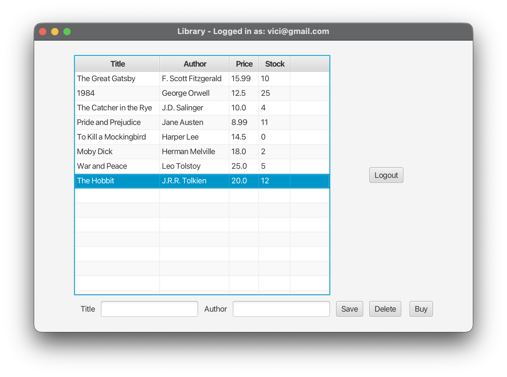
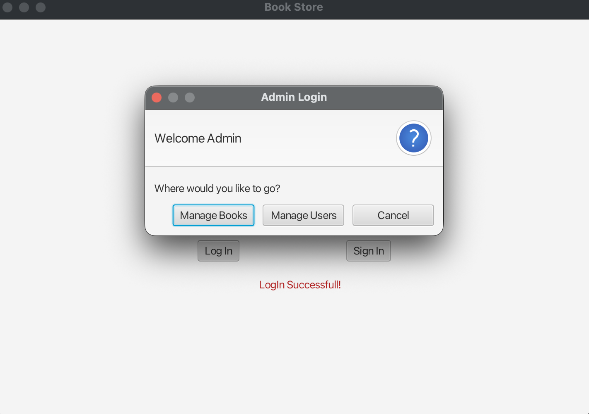
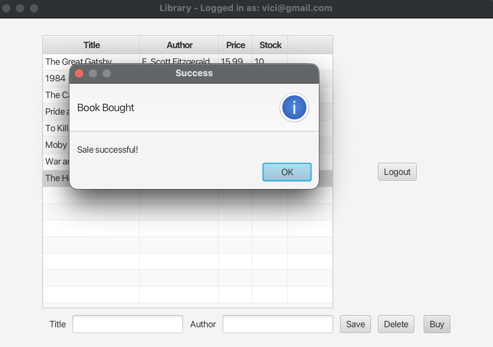
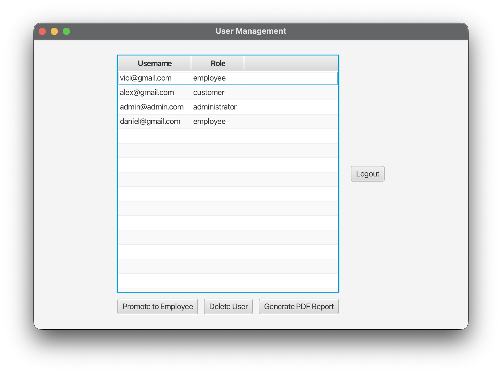
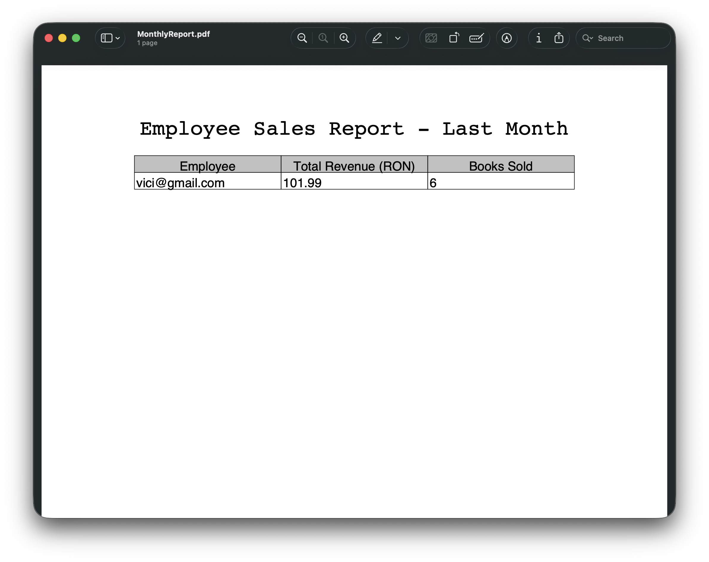

# 📚 Library Management System



## 1. Project Summary
This project is a comprehensive desktop application designed to digitalize and streamline library processes. It facilitates seamless interactions between three distinct types of users: Administrators, Employees, and Customers. 

The core purpose of the application is to handle book inventory, secure user authentication, process sales, and provide automated management reports. It features a robust MySQL database integration, a responsive JavaFX graphical interface, and a highly secure Role-Based Access Control (RBAC) system.

## 2. Concepts & Architecture
The application is built using modern software engineering practices to ensure scalability, maintainability, and security:
* **Architecture:** Layered Architecture (Presentation/View, Service, and Data Access/Repository layers) adhering to **SOLID principles** and Clean Code methodologies.
* **Design Patterns:** Extensive use of structural and creational patterns, including **Builder** (for complex objects), **Factory** (for component instantiation), **Singleton** (for database connections), and **Decorator** (for caching repository responses).
* **Security:** Secure authentication mechanism utilizing **SHA-256 Hashing** for passwords and granular Role-Based Access Control (RBAC) driven by relational database mapping.
* **Data Transfer:** Use of **DTOs (Data Transfer Objects)** to strictly separate database entity models from the UI presentation layer.
* **Dependency Management:** **Manual Dependency Injection** implemented via component factories, demonstrating a deep understanding of inversion of control without relying on heavy external frameworks.

## 3. Technologies Used
### ⚙️ Core & Backend Logic
* **Java 21**
* **Gradle** (Build Automation Tool)
* **JDBC (Java Database Connectivity)** for executing highly optimized native SQL queries.
* **SHA-256** for secure password cryptography.
* **iText PDF** for automated generation of monthly sales and employee activity reports.

### 💻 Frontend (GUI)
* **JavaFX** (for a responsive, component-based desktop user interface)

### 🗄️ Database & Infrastructure
* **MySQL** (Relational Database Management System)
* **Git** (Version Control)
* **JUnit 5** (Unit Testing)

## 📸 Application Previews

### 1. Secure Login & Role Routing
Users are dynamically routed based on their database-assigned role (Customer, Employee, Administrator).


### 2. Point of Sale & Inventory Management
Real-time stock updates upon successful book purchases.


### 3. User Management Dashboard
Administrators have access to a dedicated dashboard to promote customers to employees, delete users, and track activity.


### 4. Automated PDF Reporting
Administrators can generate detailed monthly sales reports (powered by iText PDF) to track employee performance and total revenue.


## 4. Documentation & Context
This project was developed as a comprehensive practical implementation for the **Software Engineering** course, focusing on architectural patterns, database relational design, and secure application flow.

## 5. How to Run Locally

To run this application on your local machine, you will need to set up the Java environment and a local MySQL server.

**Prerequisites:**
* [Java JDK 21](https://www.oracle.com/java/technologies/javase/jdk21-archive-downloads.html)
* [MySQL Server](https://dev.mysql.com/downloads/mysql/) running on the default port `3306`.
* Your preferred Java IDE (IntelliJ IDEA, Eclipse, etc.)

**Setup Steps:**

1. **Clone the repository:**
   ```bash
   git clone https://github.com/vici1136/java-library-management-system.git
   cd java-library-management-system
   ```

2. **Configure the Database Credentials:**
   Navigate to `src/main/java/database/JDBConnectionWrapper.java` and ensure the database credentials match your local MySQL setup:
   ```java
   private static final String USER = "root";
   private static final String PASSWORD = "your_mysql_password"; 
   ```

3. **Initialize the Database:**
   Run the `main` method inside the `database.Bootstrap.java` class. 
   > ⚠️ **Note:** This script will drop any existing library tables and recreate a fresh schema (including all foreign key constraints), automatically populating the necessary roles (`Administrator`, `Employee`, `Customer`) and rights.

4. **Start the Application:**
   Run the `main` method inside the `launcher.Main.java` class to launch the JavaFX GUI.

5. **Test Accounts:**
   You can create a new account directly from the app's "Sign Up" screen. Alternatively, after running `Bootstrap`, you can inject test users directly into your MySQL database or use the admin panel to promote newly created customers to Employees or Administrators.

## 6. Testing Strategy

The application includes a comprehensive suite of unit tests to ensure the reliability of the business logic and data access layers.

* **Framework:** JUnit 5
* **Approach:** Unit testing focuses primarily on the **Service layer** and **Repository layer**, ensuring that business rules (like stock validation during sales) operate correctly.
* **Mocking:** Custom mock implementations (e.g., `BookRepositoryMock`) are utilized to isolate services from the actual MySQL database. This ensures fast, deterministic test execution without causing side effects to the actual data.

**To run the tests:**
You can run the tests directly from your IDE's testing interface, or by executing the following Gradle command in your terminal:
```bash
./gradlew test
```
